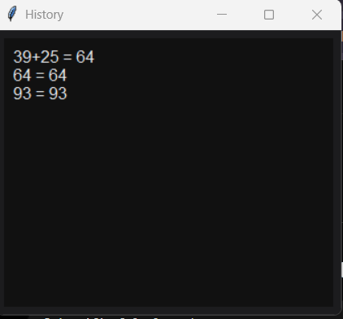

<h1 align="center">Scientific Calculator</h1>
<p align="center">
A Python-based Scientific Calculator built using Tkinter.
</p>
## Features

- Basic Arithmetic Operations
- Scientific Functions
  - Sine
  - Cosine
  - Tangent
  - Logarithm
  - Natural Log
  - Factorial
  - Square Root
  - Exponentials
- Memory Functions (M+, M-, MR, MC)
- History Management
- Export Calculation History
- Dark/Light Theme
- Keyboard Support

## Technologies Used

- Python
- Tkinter
- Math Module

## How to Run

```bash
python calculator.py
```

## Screenshots

## Home Screen


## Scientific Mode


## History Window


## Author

Bhargavi Odnala
